# MyShell 设计文档

>   设计文档目录：
>
>   *   第一部分：需求概述
>   *   第二部分：使用说明
>   *   第三部分：实现步骤
>   *   第四部分：功能展示

## 第一部分：功能（需求）概述

使用 C 语言编写一个简单的 Shell（MyShell），为用户提供 Linux 的命令行式交互界面。

*   开发与运行环境：Linux 发行版 Ubuntu 22.04.4 LTS
*   可以运行 **内部指令**（`cd` 和 `exit`，暂不支持 `history`）
*   可以运行 **外部指令**（如 `ls`, `ps` 等等，以及其他用户的可执行文件）
*   支持标准输入和标准输出 **重定向**
*   可以通过 **管道** 连接多个命令

## 第二部分：使用说明

项目结构：

```shell
.			
├── MyShell 设计文档.pdf	 # 设计文档
├── main.c					# MyShell 源文件
├── Makefile
├── case					# 测试用例
    ├── hello.c
    ├── isOdd.c
    ├── plus.c
    ├── square.c
    ├── sub1.c
    └── sum.c
```

编译 MyShell 源文件：

```shell
$ make
```

运行 MyShell 可执行文件

```shell
$ make run
```

生成辅助测试用例

```shell
$ make test
```

## 第三部分：实现步骤

### 命令的解析：层次抽象的文法解析

我们当然可以直接对标准输入的一列字符流进行分析，解析出命令。

但计算机程序的构造和解析强调 **抽象（Abstraction）**，我们可以采用适当的抽象，进行 **层次化** 解析，从而实现对输入字符流的文法解析，如图 1 所示。


<center>图 1：命令解析流程图</center>

#### Token

`fgets` 从标准输入后得到 `buf` ，然后 `parseTokens `函数将字符流拆解为一系列原子单元 `Token`（不可再细分的最小单元）。

`Token` 结构体不但记录字符串信息（`char *str` 和 `unsigned int len`），而且划分单元的 **类型**，为下一步进行做好铺垫。

其中包括 7 种类型：`TOKEN_SYM`（如 `cd`, `-l`, `xxx.x`）、`TOKEN_STR`（如 `"a.txt"`, `'hello unix'`）、`TOKEN_PIPE`（即 `|`）、`TOKEN_REDIR_IN`（即 `<`）、`TOKEN_REDIR_OUT`（即 `>`）、`TOKEN_REDIR_APD`（即 `>>`）。

```c
typedef enum {
    TOKEN_SYM, TOKEN_STR, TOKEN_PIPE,TOKEN_END,TOKEN_REDIR_IN, TOKEN_REDIR_OUT, TOKEN_REDIR_APD  
} Token_t;

typedef struct {
	Token_t type;
	char *str;
	unsigned int len;
} Token;
```

#### Cmd

接着上一步，若干 `Token` 将构成一个`Cmd`，管道 `|` 连接的多个 `Cmd` 正是用户最开始给出的一条“指令”。

`Cmd` 结构体记录可执行文件的路径 `cmd_target` 和参数列表 `cmd_args`，二者将被 `execvp` 系统调用使用。

除此之外，`Cmd` 结构体还记录重定向路径信息 `cmd_file_in`、`cmd_file_out`、`cmd_file_apd` （若无则为 `NULL`）。以上信息（如有）将被 `dup2` 系统调用用于复制文件描述符表。

```c
typedef struct {
	char *cmd_file_in,*cmd_file_out,*cmd_file_apd,*cmd_target;
	char **cmd_args;
} Cmd;
```

交由 `parseCmds(cmds, tokens)` 完成以上步骤之后，文法解析的部分就大功告成了。

### 命令的执行：系统调用与进程 fork

在命令的执行 `execCmd` 和 `execCmdAll` 部分，我们使用到的系统调用如下

| 系统调用 | 作用                                    |
| -------- | --------------------------------------- |
| `getcwd` | 获取当前目录                            |
| `chdir`  | 切换当前目录                            |
| `exit`   | 出现异常或使用 `exit` 命令时终止进程    |
| `open`   | 打开文件                                |
| `dup2`   | 复制文件描述符表                        |
| `fork`   | 创建进程 **（与 exec 类命令搭配使用）** |
| `execvp` | 执行程序 **（与 fork 命令搭配使用）**   |
| `wait`   | 等待进程                                |
| `pipe`   | 创建管道                                |
| `close`  | 关闭管道读/写端                         |

基于前面解析出的 `Cmd` 信息，便可以执行命令：

*   对于内部指令（在 MyShell 中为 `cd` 和 `exit`），直接使用相应的系统调用；
*   对应外部资料，将通过 `fork` 创建子进程，子进程使用 `execvp` 来执行程序。

命令的执行过程如下面的流程图所示。


<center>图 2：命令执行流程图</center>

## 第三部分：功能测试

### 路径提示

`make run` 之后，会显示欢迎界面 ：）。当前路径会显示在命令行。

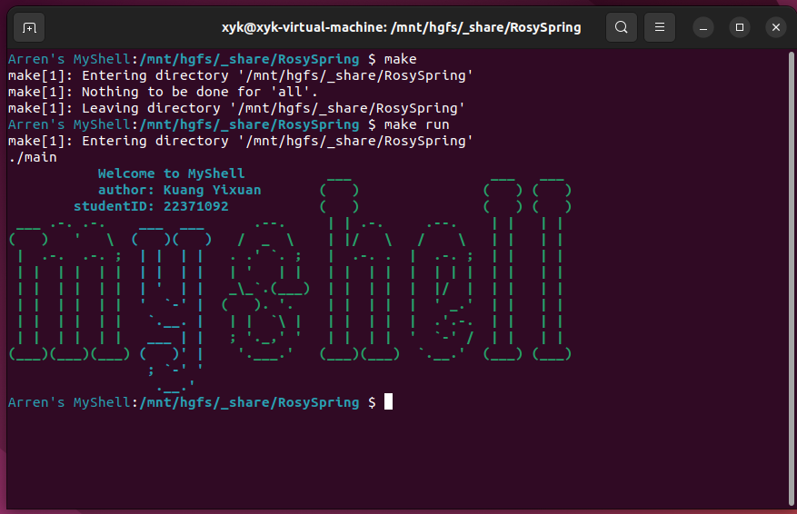

### 内部命令 cd

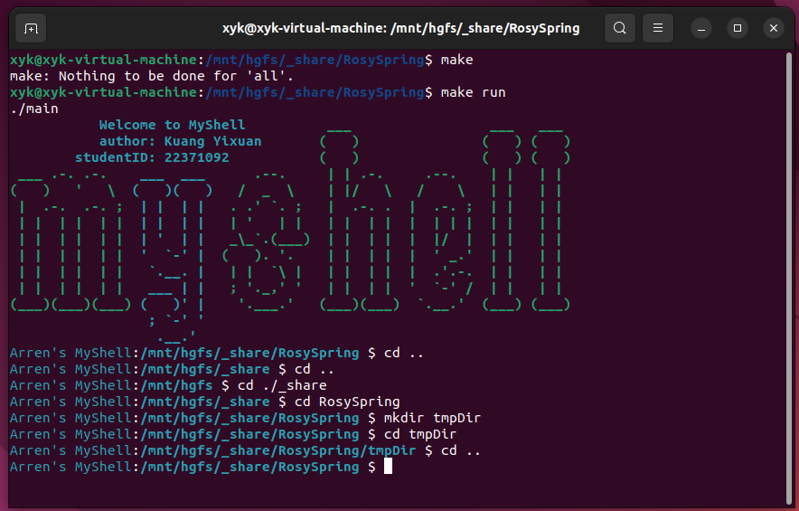

### 外部命令的执行

#### 不带参数与带参数

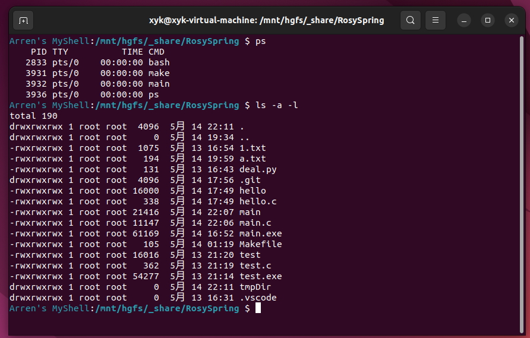

#### 带固定数量参数

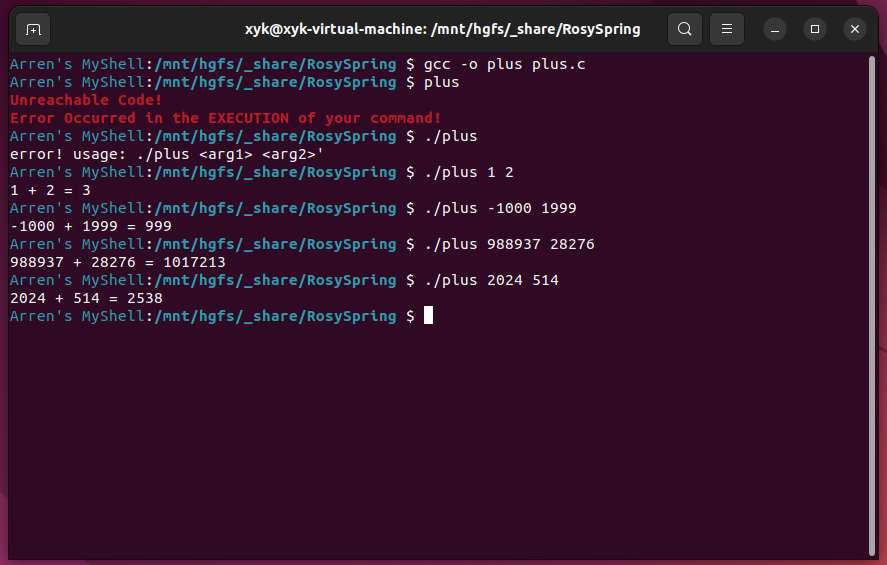

#### 变长参数

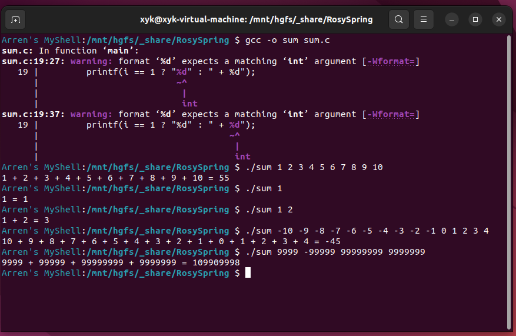

### 支持文件重定向

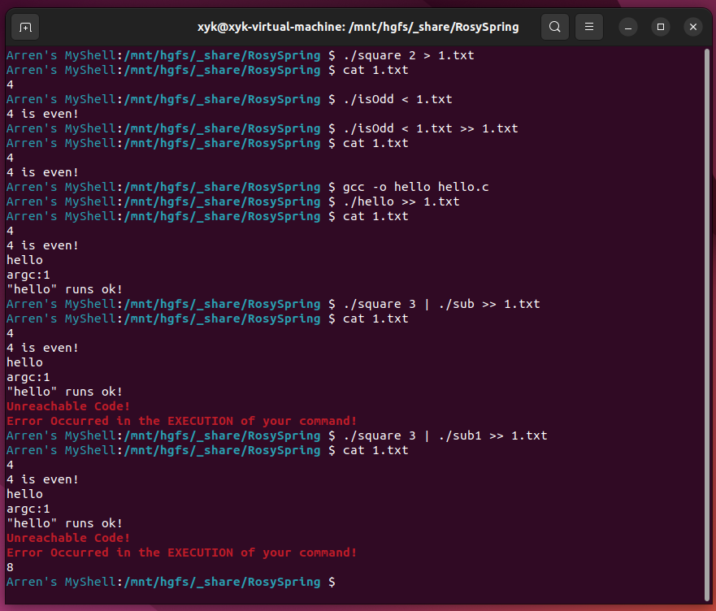

### 支持管道

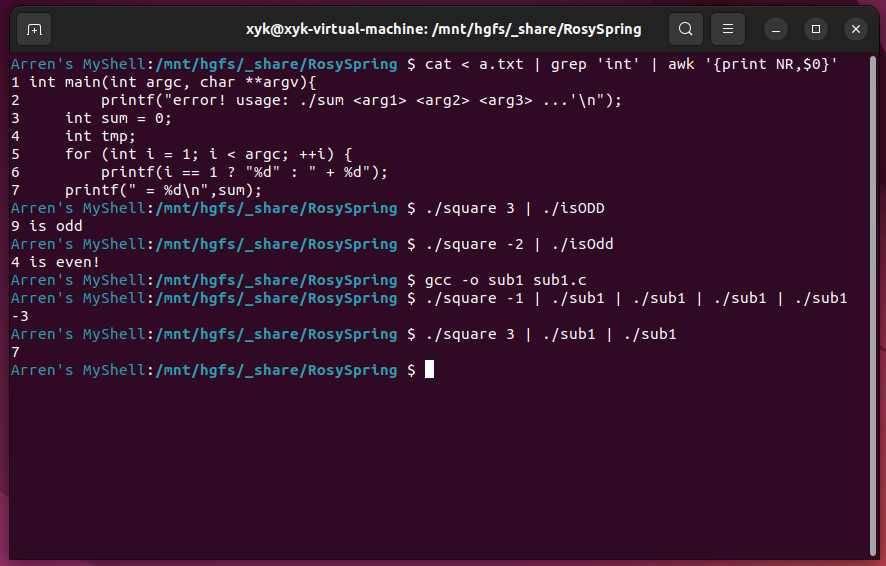

### 错误提示


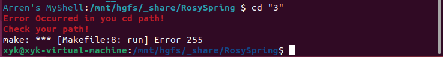

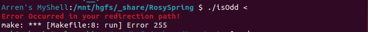

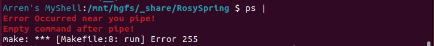


### 转义字符处理

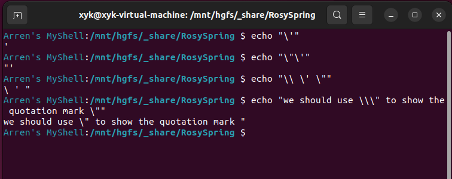

### 内部命令 exit

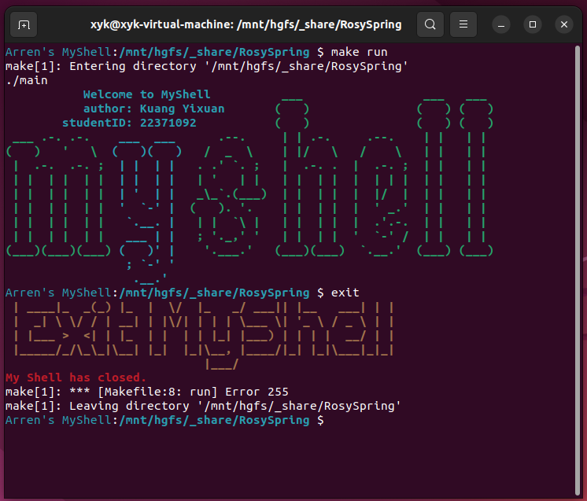

## 写在最后

*   这个 Shell 只是一个简单的 Shell，可扩展空间还非常大。比如异常重定向、其他的内部命令等等。
*   通过自己写一个 Shell，我加深了对操作系统相关概念的理解，比如一条命令执行时，用户空间做了什么，内核空间做了什么。
*   此外，我还加深了对 C 语言这门本身就和 Unix 系统紧密相关的语言的掌握，C 语言深入底层，向下直接能和系统打交道，向上又能服务用户。而且，“没学过指针，就不算学过 C 语言”，这次写 MyShell 时一些一级指针和二级指针、指针的深浅拷贝相关的调试经历，也让我对指针的掌握更加牢固。
